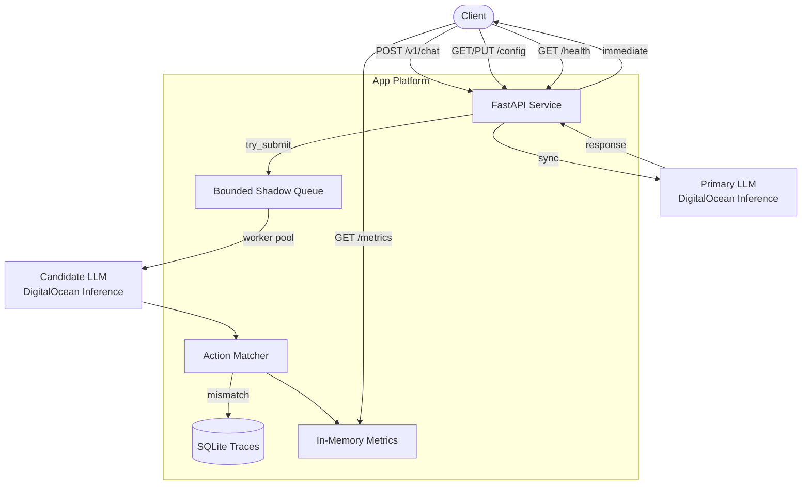

# LLM Evaluator API Service

A FastAPI proxy that serves synchronous primary LLM responses while running asynchronous shadow evaluation against a candidate model. Built for safe model rollouts on DigitalOcean Inference with bounded background load and observable match metrics.

## Architecture



**Request path:** `/v1/chat` calls the primary model and returns its response immediately. A copy of the request/response pair is enqueued for background comparison when routing rules allow.

**Shadow path:** Worker tasks dequeue items, call the candidate model with a shorter timeout, compare structured outputs, update metrics, and persist mismatches to SQLite.

## Project Structure

```
├── app/                    # FastAPI application
│   ├── main.py             # Routes and lifespan wiring
│   ├── config.py           # Settings and runtime config
│   ├── llm_client.py       # Inference HTTP client
│   ├── shadow_queue.py     # Bounded async evaluation queue
│   ├── evaluator.py        # Response comparison heuristic
│   ├── metrics.py          # Thread-safe counters
│   ├── trace_store.py      # SQLite mismatch persistence
│   └── models.py           # Pydantic schemas
├── tests/                  # Unit and integration tests
├── terraform/              # DigitalOcean infrastructure
│   ├── main.tf             # Registry + App Platform
│   ├── bootstrap/          # Spaces bucket for remote state
│   └── ...
├── scripts/
│   └── deploy.sh           # Registry → push → app deploy
├── .github/workflows/      # CI/CD
├── Dockerfile
├── Makefile
└── README.md
```

## Local Development

### Prerequisites

- Python 3.11+
- Docker (optional, for container testing)
- `doctl` and Terraform (for deployment)

### Setup

```bash
make install
cp terraform/terraform.tfvars.example terraform/terraform.tfvars  # optional
```

Create a `.env` file for local runs:

```env
INFERENCE_API_KEY=your-inference-api-key
PRIMARY_MODEL=meta-llama/Meta-Llama-3.1-8B-Instruct
CANDIDATE_MODEL=meta-llama/Meta-Llama-3.1-8B-Instruct
```

### Run locally

```bash
uvicorn app.main:app --reload --port 8000
# or
make docker-build && make docker-run
```

### Run tests

```bash
make test
```

## API Endpoints

| Method | Path        | Description                              |
|--------|-------------|------------------------------------------|
| POST   | `/v1/chat`  | OpenAI-compatible chat completion proxy  |
| GET    | `/metrics`  | Shadow evaluation counters and match rate|
| GET    | `/config`   | Current runtime configuration            |
| PUT    | `/config`   | Update shadow routing percentage         |
| GET    | `/health`   | Liveness probe                           |

### Example: chat request

```bash
curl -s http://localhost:8000/v1/chat \
  -H "Content-Type: application/json" \
  -d '{
    "messages": [{"role": "user", "content": "Return JSON with action buy"}],
    "temperature": 0
  }' | jq .
```

### Example: metrics

```bash
curl -s http://localhost:8000/metrics | jq .
```

Sample response:

```json
{
  "total_requests": 42,
  "shadow_submitted": 40,
  "shadow_dropped": 2,
  "shadow_errors": 0,
  "shadow_timeouts": 1,
  "total_comparisons": 37,
  "total_matches": 35,
  "match_rate_percent": 94.59,
  "shadow_queue_depth": 3,
  "shadow_active_workers": 2
}
```

### Example: update shadow routing

Reduce background load by routing only 50% of requests to shadow evaluation:

```bash
curl -s -X PUT http://localhost:8000/config \
  -H "Content-Type: application/json" \
  -d '{"shadow_routing_percentage": 50}' | jq .
```

## Memory Bounding

The service is designed so background evaluation cannot exhaust instance memory or starve the primary request path:

| Control | Default | Effect |
|---------|---------|--------|
| `shadow_queue_max_size` | 100 | Fixed-capacity `asyncio.Queue`. When full, new shadow tasks are **dropped** (`shadow_dropped` metric increments). |
| `shadow_max_workers` | 10 | Semaphore limits concurrent candidate LLM calls per instance. |
| `shadow_timeout_seconds` | 30 | Candidate requests time out independently of the primary path. |
| `shadow_routing_percentage` | 100 | Runtime-tunable sampling (0–100%) via `PUT /config`. |
| `primary_timeout_seconds` | 60 | Primary path timeout; shadow work never blocks this response. |

**Per-instance scaling:** App Platform runs 2–10 instances (see Terraform). Each instance maintains its own in-memory queue, metrics, and SQLite file. Queue depth and worker counts are per process, not global.

**Trace storage:** Mismatch traces are written to a local SQLite database (`traces.db`). On App Platform ephemeral filesystems this is suitable for debugging recent mismatches but is not durable across redeploys. Monitor `total_comparisons` vs `total_matches` via `/metrics` for rollout decisions.

## Evaluation Heuristic

Shadow evaluation compares structured actions extracted from LLM message content:

1. Parse the `choices[0].message.content` field from both primary and candidate responses as JSON.
2. Extract the `action` field when present.
3. Mark `actions_match` when **both** responses contain valid JSON, both have a non-null `action`, and the actions are equal.

Invalid JSON or missing `action` fields result in `actions_match = false`. Mismatches are persisted to SQLite with the full request/response payloads for offline review.

This heuristic targets agent-style outputs (e.g. `{"action": "buy", ...}`) and intentionally ignores free-form text similarity.

## CI/CD

### Continuous Integration

`.github/workflows/ci.yml` runs on every push and pull request:

- **CI** — Python 3.11/3.12 tests with coverage, Terraform validate, Docker build
- **CD** — deploy on push to `main` or manual `workflow_dispatch`

**Required GitHub secrets:**

| Secret | Description |
|--------|-------------|
| `DIGITALOCEAN_TOKEN` | DigitalOcean API token with registry and App Platform access |
| `INFERENCE_API_KEY` | DigitalOcean Inference API key |

**Optional secrets (remote Terraform state):**

| Secret | Description |
|--------|-------------|
| `TF_STATE_BUCKET` | Spaces bucket name |
| `TF_STATE_REGION` | Spaces region (e.g. `nyc3`) |
| `SPACES_ACCESS_KEY_ID` | Spaces access key |
| `SPACES_SECRET_ACCESS_KEY` | Spaces secret key |

When `TF_STATE_BUCKET` is **not** set, CD runs `terraform init -backend=false` (local/ephemeral state in the runner). When set, CD switches to an S3-compatible Spaces backend using generated `backend.hcl`.

## DigitalOcean Deployment

### Infrastructure

Terraform provisions:

- **Container Registry (DOCR)** — stores application images
- **Docker credentials** — enables `doctl registry login`
- **App Platform service** — autoscaling 2–10 instances, health check on `/health`

App name is shortened for the 32-character App Platform limit: `llm-eval-api-{environment}`.

Default App Platform size is `apps-d-1vcpu-0.5gb` (dedicated CPU, supports 2–10 autoscaling). Shared sizes like `basic-xxs` use a fixed 2-instance count instead.

### Troubleshooting Terraform

**`Autoscaling on CPU metrics is not allowed for instance_size_slug basic-xxs`**

You are on an outdated `terraform/main.tf`. Update and retry:

```bash
git pull origin main
grep cpu_autoscaling_enabled terraform/main.tf   # should match
make tf-apply
```

If you intentionally use `basic-xxs`, the current config disables CPU autoscaling automatically — but you must be on the latest Terraform files.

### Authentication

Provide credentials via environment variables (recommended):

```bash
export DIGITALOCEAN_TOKEN="dop_v1_..."
export INFERENCE_API_KEY="your-inference-api-key"
```

The DigitalOcean provider reads `DIGITALOCEAN_TOKEN` when `do_token` is null. The app deployment requires `TF_VAR_inference_api_key` or `INFERENCE_API_KEY` (used by `scripts/deploy.sh`).

See `terraform/terraform.tfvars.example` for all options.

### Bootstrap remote state (optional)

```bash
cd terraform/bootstrap
export DIGITALOCEAN_TOKEN="dop_v1_..."
terraform init
terraform apply -var="bucket_name=your-unique-tfstate-bucket"
```

Then follow `terraform/backend.hcl.example` to configure remote state.

### Deploy with script

```bash
export DIGITALOCEAN_TOKEN="dop_v1_..."
export INFERENCE_API_KEY="your-inference-api-key"
export ENVIRONMENT=dev          # optional, default: dev
export IMAGE_TAG=latest         # optional, default: latest

./scripts/deploy.sh
```

The script:

1. Verifies `DIGITALOCEAN_TOKEN` with `doctl account get`
2. `terraform apply` — container registry and docker credentials
3. Builds and pushes the Docker image to DOCR
4. `terraform apply` — App Platform service

**Docker requirement:** `deploy.sh` needs a running Docker daemon to build and push the image. Cursor/devcontainer environments often cannot run Docker internally.

| Environment | Recommended approach |
|-------------|---------------------|
| Cursor / devcontainer | Use **GitHub Actions CD** (Docker available on `ubuntu-latest` runners) |
| Mac with OrbStack / Docker Desktop | Run `./scripts/deploy.sh` from a local terminal with Docker running |
| Linux server | Install Docker Engine, ensure `docker info` succeeds, then run `./scripts/deploy.sh` |

To deploy without local Docker, add `DIGITALOCEAN_TOKEN` and `INFERENCE_API_KEY` as GitHub secrets, then run the **CD** workflow from **Actions → CD → Run workflow**.

### Deploy with Make / Terraform directly

```bash
make tf-init
export TF_VAR_do_token="$DIGITALOCEAN_TOKEN"
export TF_VAR_inference_api_key="$INFERENCE_API_KEY"
make tf-apply
```

### Terraform outputs

```bash
cd terraform
terraform output app_url
terraform output image_reference
```

## Configuration Reference

| Variable | Default | Description |
|----------|---------|-------------|
| `INFERENCE_BASE_URL` | `https://inference.do-ai.run` | Inference API base URL |
| `INFERENCE_API_KEY` | — | Inference API key (required in production) |
| `PRIMARY_MODEL` | `meta-llama/Meta-Llama-3.1-8B-Instruct` | Primary model ID |
| `CANDIDATE_MODEL` | `meta-llama/Meta-Llama-3.1-8B-Instruct` | Candidate model ID |
| `SHADOW_QUEUE_MAX_SIZE` | `100` | Max pending shadow tasks |
| `SHADOW_MAX_WORKERS` | `10` | Max concurrent shadow workers |
| `SHADOW_TIMEOUT_SECONDS` | `30` | Candidate request timeout |
| `SHADOW_ROUTING_PERCENTAGE` | `100` | Initial shadow sampling rate |
| `PRIMARY_TIMEOUT_SECONDS` | `60` | Primary request timeout |

## License

Internal use — see repository root for license terms.
