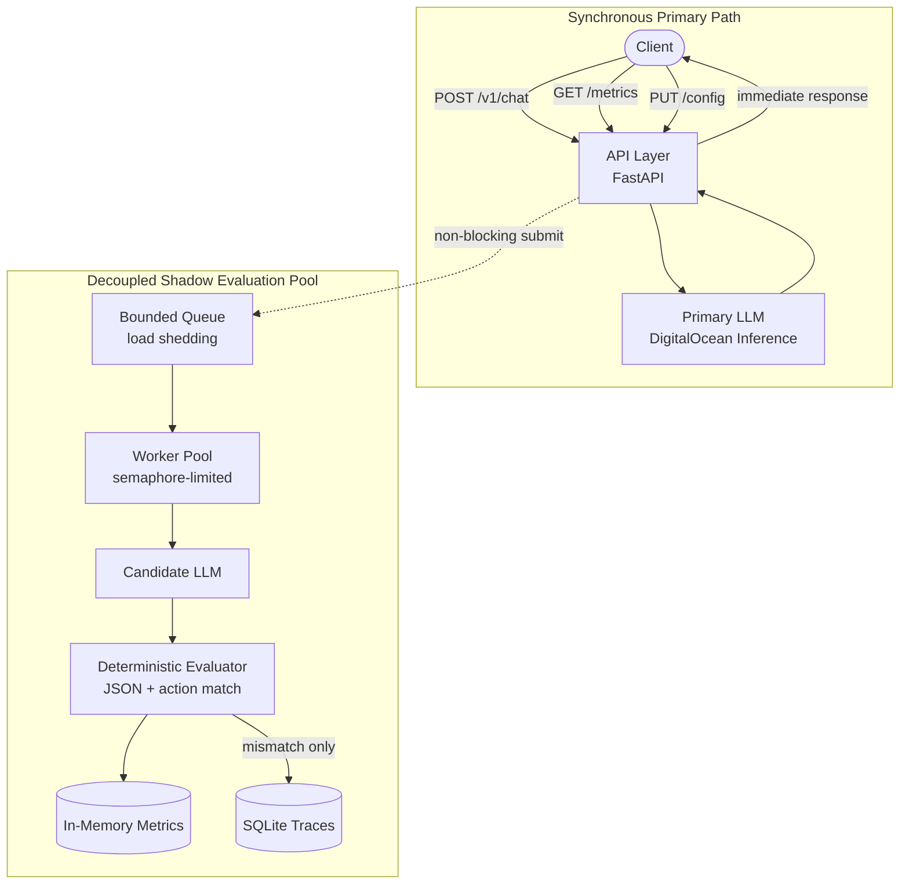
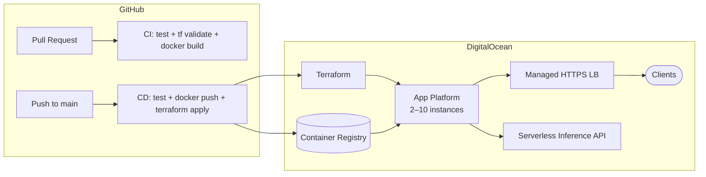

# LLM Evaluator API Service

Production-ready API proxy that serves customer traffic through a **Primary** LLM endpoint while asynchronously mirroring the same requests to a **Candidate** LLM for shadow evaluation. Primary responses are returned immediately; candidate latency, errors, and evaluation never block the user path.

## Architecture



### Request flow

1. **POST /v1/chat** — Proxy forwards the payload to the Primary model via [DigitalOcean Serverless Inference](https://docs.digitalocean.com/products/inference/reference/api/serverless-inference/) (`https://inference.do-ai.run/v1/chat/completions`) and returns the response immediately.
2. **Shadow submit** — The same payload and primary response are enqueued for background evaluation (subject to routing percentage and queue capacity).
3. **Evaluation** — Once the candidate responds, a deterministic heuristic checks:
   - Did both models return valid, parseable JSON in the assistant message content?
   - Does the `action` key match exactly between primary and candidate?
4. **Observability** — Counters are updated in memory; mismatches are persisted to SQLite asynchronously.

## Setup

### Prerequisites

- Python 3.11+
- A DigitalOcean inference API key (Personal Access Token or Gradient Model Access Key)

### Install

```bash
python -m venv .venv
source .venv/bin/activate
pip install -r requirements.txt
```

### Configuration

Copy and edit environment variables (or export them directly):

```bash
export INFERENCE_API_KEY="your-digitalocean-token"
export PRIMARY_MODEL="meta-llama/Meta-Llama-3.1-8B-Instruct"
export CANDIDATE_MODEL="meta-llama/Meta-Llama-3.1-8B-Instruct"
export SHADOW_QUEUE_MAX_SIZE=100
export SHADOW_MAX_WORKERS=10
export SHADOW_TIMEOUT_SECONDS=30
export SHADOW_ROUTING_PERCENTAGE=100
```

| Variable | Default | Description |
|----------|---------|-------------|
| `INFERENCE_BASE_URL` | `https://inference.do-ai.run` | Upstream inference API base URL |
| `INFERENCE_API_KEY` | _(empty)_ | Bearer token for upstream auth |
| `PRIMARY_MODEL` | `meta-llama/Meta-Llama-3.1-8B-Instruct` | Primary model ID |
| `CANDIDATE_MODEL` | `meta-llama/Meta-Llama-3.1-8B-Instruct` | Candidate model ID |
| `SHADOW_QUEUE_MAX_SIZE` | `100` | Max pending shadow tasks before load shedding |
| `SHADOW_MAX_WORKERS` | `10` | Max concurrent candidate requests |
| `SHADOW_TIMEOUT_SECONDS` | `30` | Candidate request timeout |
| `SHADOW_ROUTING_PERCENTAGE` | `100` | Initial % of requests mirrored (0–100) |
| `TRACE_DB_PATH` | `traces.db` | SQLite file for mismatch traces |

### Run

```bash
uvicorn app.main:app --host 0.0.0.0 --port 8000
```

## API Usage

### Chat (primary proxy)

```bash
curl -s -X POST http://localhost:8000/v1/chat \
  -H "Content-Type: application/json" \
  -d '{
    "messages": [
      {"role": "system", "content": "Respond with JSON only: {\"action\": \"<verb>\"}"},
      {"role": "user", "content": "Find flights to Lisbon"}
    ],
    "temperature": 0
  }' | jq .
```

### Metrics

```bash
curl -s http://localhost:8000/metrics | jq .
```

Example response:

```json
{
  "total_requests": 42,
  "shadow_submitted": 40,
  "shadow_dropped": 2,
  "shadow_errors": 1,
  "shadow_timeouts": 0,
  "total_comparisons": 37,
  "total_matches": 35,
  "match_rate_percent": 94.59,
  "shadow_queue_depth": 3,
  "shadow_active_workers": 2
}
```

### Mutating metrics (step-by-step)

Send several chat requests to drive counters, then inspect metrics:

```bash
# 1. Baseline
curl -s http://localhost:8000/metrics | jq .

# 2. Send a chat request (increments total_requests, enqueues shadow)
curl -s -X POST http://localhost:8000/v1/chat \
  -H "Content-Type: application/json" \
  -d '{"messages":[{"role":"user","content":"Return {\"action\": \"search\"}"}]}'

# 3. Wait briefly for background evaluation
sleep 1

# 4. Check updated metrics (match rate, comparisons, etc.)
curl -s http://localhost:8000/metrics | jq .

# 5. Throttle shadow traffic to 50%
curl -s -X PUT http://localhost:8000/config \
  -H "Content-Type: application/json" \
  -d '{"shadow_routing_percentage": 50}' | jq .

# 6. Send more requests — roughly half will be mirrored
for i in $(seq 1 10); do
  curl -s -X POST http://localhost:8000/v1/chat \
    -H "Content-Type: application/json" \
    -d "{\"messages\":[{\"role\":\"user\",\"content\":\"request $i\"}]}" > /dev/null
done

sleep 2
curl -s http://localhost:8000/metrics | jq '{total_requests, shadow_submitted, shadow_dropped, match_rate_percent}'
```

### Runtime configuration

```bash
# Get current config
curl -s http://localhost:8000/config | jq .

# Throttle shadow mirroring from 100% down to 25%
curl -s -X PUT http://localhost:8000/config \
  -H "Content-Type: application/json" \
  -d '{"shadow_routing_percentage": 25}' | jq .
```

## How this service bounds memory footprint under load

Shadow evaluation is intentionally **decoupled** from the primary request path and bounded on three axes:

1. **Non-blocking enqueue with load shedding** — `try_submit()` uses `Queue.put_nowait()`. If the bounded queue (`SHADOW_QUEUE_MAX_SIZE`) is full, the task is **dropped immediately** and `shadow_dropped` is incremented. No unbounded backlog of pending evaluations can accumulate in memory.

2. **Worker concurrency cap** — A fixed pool of asyncio workers (`SHADOW_MAX_WORKERS`) guarded by a semaphore limits how many candidate HTTP calls run concurrently. Under burst traffic, excess work waits in the bounded queue or is shed; it never spawns unbounded tasks.

3. **No response buffering on the hot path** — The primary handler only stores a reference to the request payload and primary response when enqueue succeeds. Candidate responses are processed and discarded (or a single SQLite row is written for mismatches). Metrics are fixed-size integer counters.

Together, worst-case memory for shadow work is approximately:

```
O(SHADOW_QUEUE_MAX_SIZE × avg_task_size) + O(SHADOW_MAX_WORKERS × avg_response_size)
```

The primary proxy footprint stays stable regardless of candidate slowness or failure.

## Evaluation heuristic

For each completed shadow comparison:

| Check | Rule |
|-------|------|
| JSON validity | Assistant `content` must parse as a JSON object |
| Action extraction | Read `action` key from each parsed object |
| Match | `primary.action == candidate.action` (exact string match) |

A comparison counts toward `match_rate_percent` only when evaluation completes (candidate responded without error/timeout).

## Persistent mismatch traces

Mismatched evaluations are written asynchronously to `traces.db` (configurable via `TRACE_DB_PATH`). Each row stores the request payload, both responses, and the evaluation result for offline debugging.

## Testing

```bash
pytest tests/ -v --cov=app
```

Tests cover:

- Evaluator JSON/action matching logic
- Metrics calculations
- Shadow queue load shedding, timeouts, and routing percentage
- Full API integration (chat, metrics, config, health)

## CI/CD

GitHub Actions runs on every push and pull request:

| Workflow | Trigger | Jobs |
|----------|---------|------|
| [`ci.yml`](../.github/workflows/ci.yml) | Push / PR | Tests (3.11 & 3.12), Terraform validate, Docker build |
| [`cd.yml`](../.github/workflows/cd.yml) | Push to `main` / manual | Test → build image → Terraform deploy |

## DigitalOcean deployment

Production infrastructure is defined in [`terraform/`](terraform/) and targets **high availability** via DigitalOcean App Platform:

- **2+ instances** minimum across the App Platform fleet (configurable `min_instances`)
- **CPU autoscaling** up to `max_instances` (default 10)
- **Built-in HTTPS load balancer** with `/health` probes
- **Container Registry (DOCR)** for immutable image deploys



### Prerequisites

1. DigitalOcean account with API token (`read` + `write`)
2. GitHub repository with Actions enabled
3. (Recommended) DigitalOcean Spaces bucket for remote Terraform state — bootstrap via [`terraform/bootstrap/`](terraform/bootstrap/)

### GitHub secrets

| Secret | Required | Description |
|--------|----------|-------------|
| `DIGITALOCEAN_TOKEN` | Yes | API token for Terraform and `doctl` |
| `INFERENCE_API_KEY` | Yes | Serverless Inference key injected into App Platform |
| `TF_STATE_BUCKET` | Recommended | Spaces bucket name for remote state |
| `SPACES_ACCESS_KEY_ID` | Recommended | Spaces access key |
| `SPACES_SECRET_ACCESS_KEY` | Recommended | Spaces secret key |

Create the GitHub **production** environment (Settings → Environments) to gate deploy approvals.

### One-time bootstrap (remote state)

```bash
cd terraform/bootstrap
terraform init
terraform apply -var="do_token=$DIGITALOCEAN_TOKEN"

# Copy terraform/backend.hcl.example → terraform/backend.hcl and fill in bucket name
cd ..
terraform init -backend-config=backend.hcl
```

### Manual deploy

```bash
export DIGITALOCEAN_TOKEN="dop_v1_..."
export TF_VAR_do_token="$DIGITALOCEAN_TOKEN"
export TF_VAR_inference_api_key="your-inference-key"

# 1. Create registry + app infrastructure
cd terraform
terraform init -backend-config=backend.hcl   # or -backend=false for local state
terraform apply -target=digitalocean_container_registry.this

# 2. Build and push image
doctl registry login
REGISTRY=$(terraform output -raw registry_endpoint)
docker build -t "$REGISTRY/llm-evaluator-api-service:latest" ..
docker push "$REGISTRY/llm-evaluator-api-service:latest"

# 3. Deploy / update App Platform
terraform apply -var="image_tag=latest"
terraform output app_url
```

### Scaling and HA knobs

Edit `terraform/terraform.tfvars` or pass `-var` flags:

| Variable | Default | Purpose |
|----------|---------|---------|
| `min_instances` | `2` | HA floor — always at least 2 running instances |
| `max_instances` | `10` | Autoscale ceiling |
| `instance_size_slug` | `professional-xs` | Per-instance CPU/RAM |
| `region` | `nyc` | App Platform region |

App Platform performs rolling deploys and removes unhealthy instances automatically when `/health` fails.

### Multi-instance caveats

- **`GET /metrics`** returns counters for the instance that served the request (in-memory per instance). For fleet-wide metrics, add a Prometheus sidecar or external aggregator as a follow-up.
- **SQLite mismatch traces** are stored on each instance's ephemeral `/tmp` volume. For shared trace storage, migrate to DigitalOcean Managed PostgreSQL.

## Project structure

This service lives at `llm-evaluator-api-service/` in the monorepo:

```
llm-evaluator-api-service/
  app/                  # FastAPI application
  terraform/            # DigitalOcean infrastructure (DOCR + App Platform)
  terraform/bootstrap/  # One-time Spaces bucket for remote state
  tests/
  Dockerfile
  Makefile
```

CI/CD workflows are at the repo root in `.github/workflows/` (required by GitHub Actions).

## License

MIT
